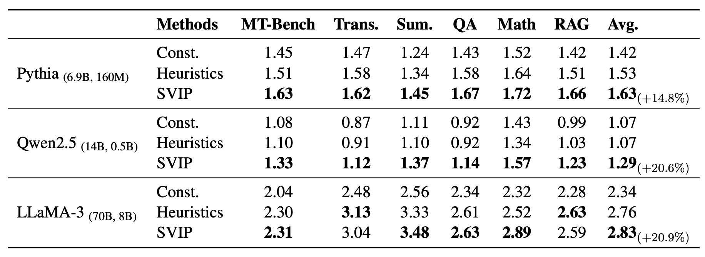
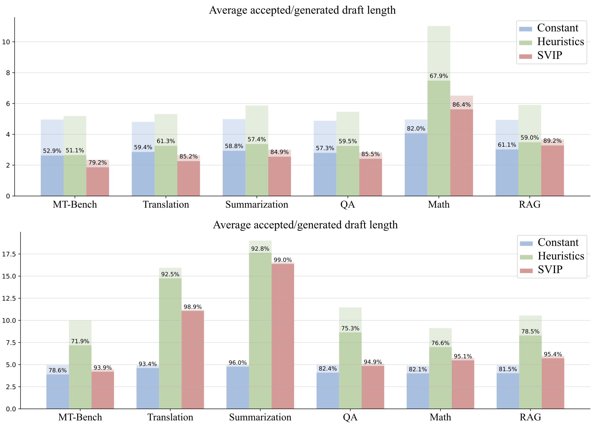
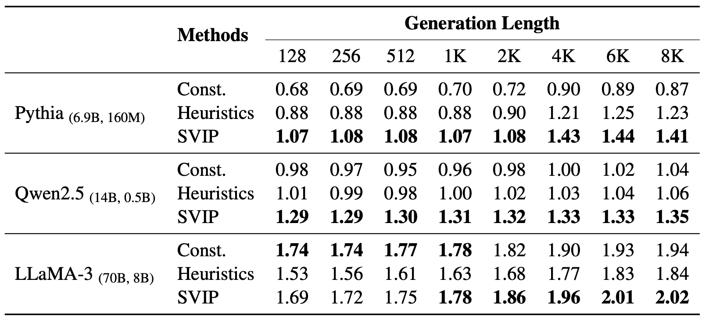
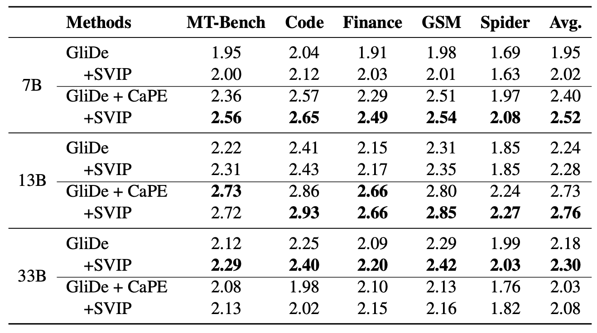
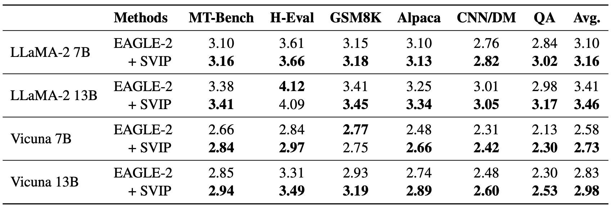

# SVIP

Think your LLM inference is slow? Try **SVIP**💳, a plug-and-play, training free dynamic draft length control policy for any speculative decoding system with an auto-regressive draft model.

Vanilla speculative decoding on [SpecBench](https://arxiv.org/abs/2401.07851) (temperature set to 0):

<p align="center">
</img>
</p>

Draft length comparison (Qwen2.5 on top, LLaMA-3 at the bottom):

<p align="center">
</img>
</p>

Long-form generation on [MT-Bench](https://arxiv.org/abs/2306.05685) (temperature set to 1):

<p align="center">
</img>
</p>

[GliDe with a CaPE](https://arxiv.org/abs/2402.02082) plus SVIP:

<p align="center">
</img>
</p>

[EAGLE-2](https://arxiv.org/abs/2406.16858) plus SVIP:

<p align="center">
</img>
</p>

### Evaluation

#### Vanilla SD

A streamlined version of speculative decoding is given in `vanilla-sd`, with three baselines implemented besides SVIP:

- target-model-only inference: pass an empty string as the `draft_model` argument.

- constant draft length: pass 'constant' as `length_policy`, and set draft length with the `draft_length` argument

- heuristics (from Hugging Face): this policy increases draft length by 2 if all draft tokens are accepted in the current round, and otherwise decreases it by 1. Pass 'heuristics' as `length_policy`. The `draft_length` argument will set the initial draft length.

For all length policies, two decoding stratigies are available: greedy decoding and temperature sampling with temperature = 1. Change the `sample` argument to switch between them.

Note that our experiments are run on A100 GPUs with 40GB memory. If you use other types of GPUs, please modify the `memory_first_gpu` and `memory_per_gpu` arguments accordingly. `memory_first_gpu` specifies the memory reserved for the target model on the frst GPU, while `memory_per_gpu` specifies the memory reserved on each of the rest GPUs. Draft model is placed on the first GPU, so please take that into consideration when setting `memory_first_gpu`. These two arguments are only used if more than one GPU is used.

#### GliDe with a CaPE

Coming soon.

#### EAGLE-2

Coming soon.

### Reference

```
@misc{zhang2024draftmodelknowsstop,
      title={Draft Model Knows When to Stop: A Self-Verification Length Policy for Speculative Decoding},
      author={Ziyin Zhang and Jiahao Xu and Tian Liang and Xingyu Chen and Zhiwei He and Rui Wang and Zhaopeng Tu},
      year={2024},
      eprint={2411.18462},
      archivePrefix={arXiv},
      primaryClass={cs.CL},
      url={https://arxiv.org/abs/2411.18462},
}
```
